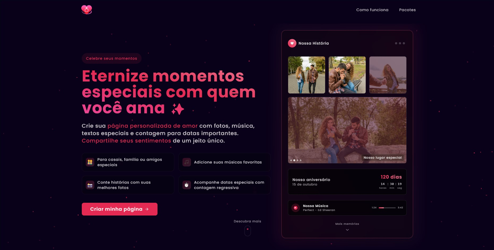

# Love Made - Crie Páginas de Amor Personalizadas

## Sobre o Projeto

Love Made é uma aplicação web que permite aos usuários criarem páginas de amor personalizadas para pessoas especiais ou até mesmo para animais de estimação. Cada página pode ser customizada com fotos, mensagens personalizadas, músicas escolhidas pelo usuário, contador para datas comemorativas e muito mais.

### Objetivo

Oferecer uma plataforma intuitiva onde qualquer pessoa possa expressar seus sentimentos de forma única e criativa, criando uma página digital memorável para presentear alguém especial.

## Funcionalidades

- **Personalização Completa**: Adicione fotos, mensagens, escolha cores e temas que combinam com sua história
- **Integração com Música**: Busque e adicione músicas do YouTube diretamente na sua página
- **Player de Música Embutido**: Reprodução completa da música escolhida diretamente na página
- **Contador de Datas**: Adicione contadores para datas especiais como aniversários de namoro/casamento
- **Planos Flexíveis**: Diferentes opções de planos para atender às necessidades de cada usuário
- **Responsivo**: Experiência perfeita em dispositivos móveis, tablets e desktop

## Tecnologias Utilizadas

### Frontend
- **Next.js 15**: Framework React com renderização do lado do servidor
- **React 19**: Biblioteca para construção de interfaces
- **TypeScript**: Superset JavaScript tipado
- **TailwindCSS**: Framework CSS para design responsivo
- **Framer Motion**: Biblioteca para animações fluidas
- **shadcn/ui**: Componentes de UI customizáveis
- **Embla Carousel**: Carrossel de imagens otimizado
- **React Hook Form**: Gerenciamento de formulários
- **Zod**: Validação de dados com tipagem

### Backend & Integração
- **Stripe**: Processamento de pagamentos via cartão de crédito
- **Supabase** (em implementação): Banco de dados e autenticação
- **YouTube**: Integração para busca e reprodução de músicas
- **Next.js API Routes**: Backend serverless

### Implantação
- **Vercel**: Plataforma para hospedagem e deploy contínuo

## Fluxo de Uso

1. **Página Inicial**: O usuário conhece o produto e escolhe um plano
2. **Criação**: Personaliza sua página de amor com fotos, músicas e mensagens
3. **Checkout**: Realiza o pagamento através da integração com Stripe
4. **Publicação**: Recebe um link único para compartilhar sua página personalizada

## Funcionalidades Futuras

- **Integração com Mercado Pago**: Suporte a pagamentos via PIX
- **Temas Adicionais**: Mais opções de design para personalização
- **Exportação para PDF**: Opção para baixar a página em formato PDF
- **Notificações**: Lembretes de datas especiais via e-mail
- **Suporte a Vídeos**: Adicionar vídeos curtos personalizados

---

Desenvolvido com ❤️ por [Lucas Fernandes](https://www.linkedin.com/in/lucasfernandesreis/)
